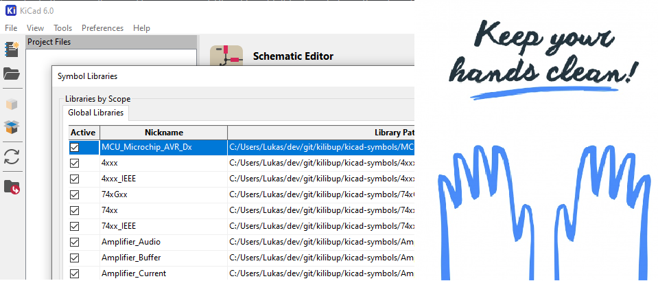

# Kilibup

Script tool that downloads and links all [official KiCad libraries](https://gitlab.com/kicad/libraries) to your local KiCad v6 or v5 installation (library configuration files `*-lib-table`). ATM only the schematic symbol and PCB footprint libararies installation are supported.

## Motivation
I found it very tedious to do this manually using library manager GUI and I couldn't find any help on the internet to speed up this process. So I made this tool. Cheers! 

PS: It's my very first python application. lol.

# Dependencies

- [KiCad](https://www.kicad.org/) v6 or v5
- [git](https://git-scm.com/)
- [python](https://www.python.org/downloads/) v3.8.10 or higher

# Usage

0. Open up powershell or shell on this repository directory.

1. See help, familiarize with options.
    ```
    python kilibup.py -h
    ```

1. Run the script:

    for KiCad v6:
    ```
    python kilibup.py
    ```

    for KiCad v5:
    ```
    python kilibup.py -v 5
    ```

2. Restart KiCad
3. Open up KiCad library managers to see if no errors and new libraries added.
4. Cheers!
